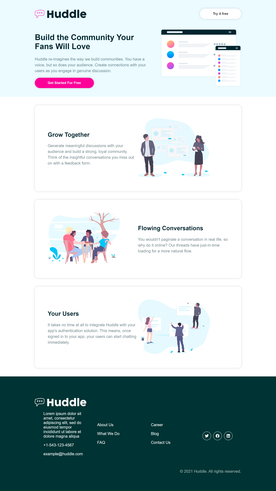

# REACT - Styled Components

## Live Demo

https://hvddle.netlify.app/

### About

In this project we take a deep dive into creating CSS within React utilizing the Styled Components plugin method. We build a simple project website utilizing what we've learned.

